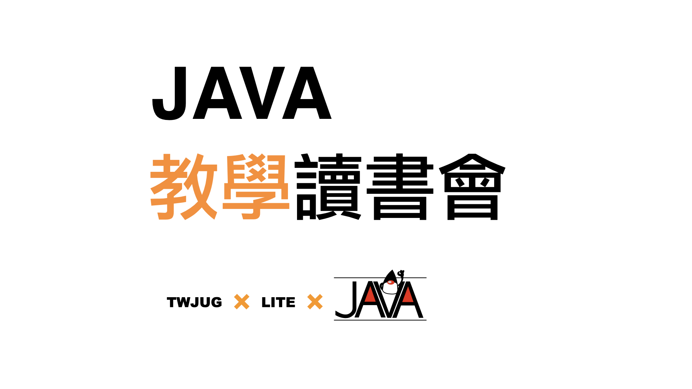
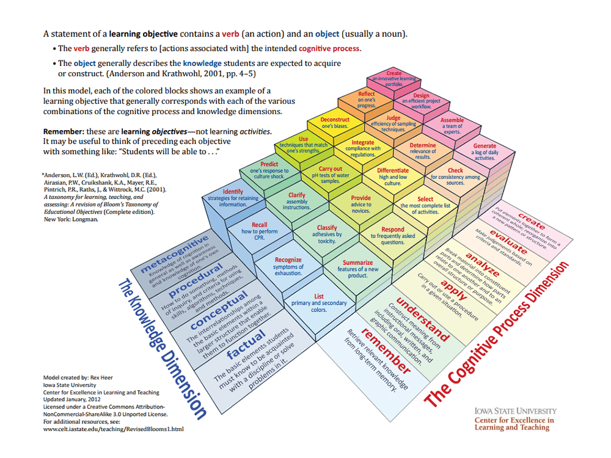

# 虛擬 Java 入門教學讀書會

大家好，線上的 TWJUG 活動又來了。這次，不僅線上還虛擬化了！因為，這是個不會有直播活動的讀書會，並且我們只鎖定在「入門」先進門了再說。那麼要怎麼入門呢？當然是要實作啊！不過，倒不是叫你看書自己做，而是透過指定**教學指引**讓你錄製 Live Demo 完成實作。

> 我們的主張：「你的理解來自你的詮釋，你的詮釋必需能透望 Live Demo 展示出來」。

每個實作課題都包括參考**教學指引(可以作為錄製影片腳本的雛型)**、要求條件和由 TWJUG 志工錄製的參考版本。只要你能開啟血輪眼，用自己的行動重現它，就會有不同的學習體驗。如果遇到困難，可以透過 GitHub Issue 尋求協助。我們也提供少量的線上助教時間以供預約。

## 活動方式

- 學習者的任務就是扮演 Java 小老師，依劇本進行教學「繳交 Demo 成果」，你得依**學習模組**錄製內容，並提供可讓活動助教審閱的網址，它最好是可以讓其他學習者觀摩的公開可存取網址，例如：上傳至 YouTube 平台。
- 可以申請暱名審查嗎？以 YouTube 平台為例，它支援 `unlisted` 模式，影片不會公開列在你的頻道列表，但知道網址的人可以存取。請將網址私訊給**助教**即可。

## 學習模組

我們將「**入門 Java SE**」的課程分成 5 個學習模組。完成這些模組可以讓你對基本概念有一些了解，並做好進入 Java 開發的準備。但請記住，這些模組無法完全取代學習者自行閱讀與實作的學習過程。想要快速獲得知識，只有透過大量的反覆閱讀與實作才有機會。

學習模組的用途是提供教學者透過實際操作和口說教學引導的台詞，來體驗教學者的視角。通過理解教學目標來理解學習的目的。

- 模組一：開始寫 Java
- *(編寫中)* 模組二：你是報導者，跟著 Debugger 走訪程式的控制結構與觀察程式狀態的改變。
- *(編寫中)* 模組三：寫個 **1A2B 猜數字** 的小遊戲吧！
- *(編寫中)* 模組四：類別與物件。
- *(編寫中)* 模組五：請借給我你的力量吧！使用別人寫好的函式庫。

活動不會包含的事項：

- Java JDK 的安裝
- 命令列：Windows 指令模式 或 Linux/OSX 的 Terminal 使用

JDK 安裝，請參考網路上的資源，只要是現行的 LTS 版本都可以使用。以撰稿時的可接受版本是 8、11、17 。劇本內的語法會以 8 為主，因為它在後續版本都可以使用，初學也不會觸及到新版本才有的功能。

命令列教學亦不包含在模組內，先假設活動參與者看得懂指示要做什麼。

## 教學模組的組織方式

每一個教學模組會有著基本的架構，大綱會依「知識維度」進行編排。

- 程序知識 (Procedural)
- 概念知識 (Conceptual)
- 事實知識 (Factual)

**「程序知識」** 指的是習得知識後應該展現出的合理行為，學習者知道需要依照什麼步驟去做，才能達成目標。

**「概念知識」** 則是用來理解程序中特定步驟的意義，例如：為什麼我們需要這樣做？如果有不同的選擇，代表什麼樣的意義？

**「事實知識」** 則是指展現程序與概念時會使用到的名詞或符號。它可能沒有明確的規則，因為是知識創造者所訂定的具體事物。

## 參考資料

- 良葛格的 Java 筆記
[https://openhome.cc/zh-tw/java/](https://openhome.cc/zh-tw/java/)
- Java SE 6 技術手冊 [https://github.com/JustinSDK/JavaSE6Tutorial](https://github.com/JustinSDK/JavaSE6Tutorial)
- Java SE 17 技術手冊 [https://www.tenlong.com.tw/products/9786263241435](https://www.tenlong.com.tw/products/9786263241435)
- [《Thinking in Java》](https://web.archive.org/web/20120717024936fw_/http://jjhou.boolan.com/jjtbooks-thinking-in-java-2e.htm) 是由侯捷等人翻譯自 [Bruce Eckel](https://en.wikipedia.org/wiki/Bruce_Eckel) 著作。網站中可下載正體中文版的試閱檔案 **tij2-c-20020711.pdf**，內容包含 1 至 9 章，及附錄部分。

