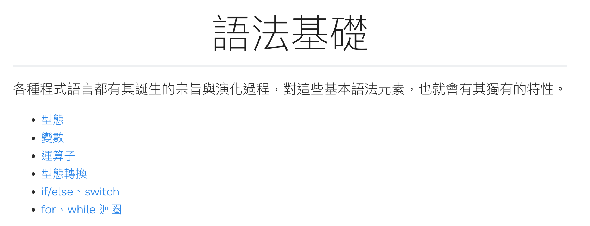
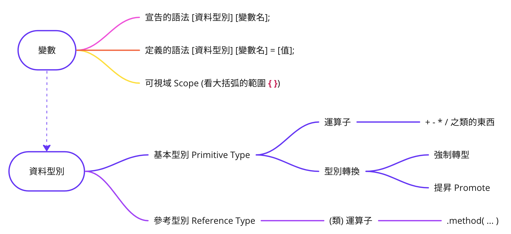

# 模組一：開始寫 Java

- 活動一：製作第一隻 Java 程式
- 活動二：語法基礎

## 活動一：製作第一隻 Java 程式

### 參考資源

[https://openhome.cc/zh-tw/java/path-package-module/hello/](https://openhome.cc/zh-tw/java/path-package-module/hello/)

### 目標

- 完成你的第 1 隻 Java 程式，可以輸出 `Hello, Java` 訊息
- **限制** 請先不要使用 IDE，這邊要讓學生感受到手工部分的細節

### 程序知識

材料：

```java
public class HelloWorld {
    public static void main(String[] args) {
        System.out.println("Hello, Java");
    }
}
```

- 用編輯器編寫 `HelloWorld.java` 文字檔
- 在檔案內填上事先準備好的素材存檔
- 使用 javac 指令編譯 `HelloWorld.java` 檔案
- 使用 java 指令執行 `HelloWorld` 類別

### 概念知識

- 一份可以執行的 Java 原始碼，要符合什麼需求？
- 類別是 Java 程式的最小執行單位？
- javac 與 java 分別是扮演什麼角色？

### 事實知識

(綜合上述的內容，自行製作速查表)

## 活動二：語法基礎

### 參考資源

- 語法基礎 [https://openhome.cc/zh-tw/java/syntax-abc/](https://openhome.cc/zh-tw/java/syntax-abc/)



- 實用的速查表 (請上網搜尋 `java cheatsheet`)
    - [https://introcs.cs.princeton.edu/java/11cheatsheet/](https://introcs.cs.princeton.edu/java/11cheatsheet/)
    - [https://www.edureka.co/blog/cheatsheets/java-cheat-sheet/](https://www.edureka.co/blog/cheatsheets/java-cheat-sheet/)

目標：

- 擴充語法基本結構，由 `類別` 增加到 `變數` 的使用。
- 認識 `資料型態` 與 `運算子`。



### 程序知識

- 練習 `宣告` 與 `定義` 變數的語法。
- 透過變數 `宣告` 觀察**自動初始化**與**未自動初始化**的情境
- 運用 `{}` 建構可視域

繼續使用先前的 `HelloWorld.java` 開始講解：

```java
public class HelloWorld {
    public static void main(String[] args) {
        System.out.println("Hello, Java");
    }
}
```

### 概念知識

- 透過基本型別表識別 `基本型別` 與 `參考型別`
- 接受 `函式呼叫` 就是參考型別的 `運算子`
    - 知道 String 類別特例 `+` `+=`
    - 物件相等性比較 `==` 與 `.equals()`