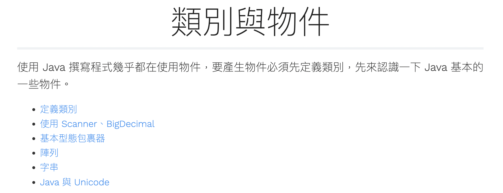

# 模組二：類別與控制結構

- 活動一：類別與物件

## 活動一：類別與物件

### 參考資源

[https://openhome.cc/zh-tw/java/object/](https://openhome.cc/zh-tw/java/object/)



### 程序知識

素材：

```java

class Clothes {
    String color;
    char size;
}

public class Field {
    public static void main(String[] args) {
        Clothes sun = new Clothes();
        Clothes spring = new Clothes();

        sun.color = "red";
        sun.size = 'S';        
        spring.color = "green";
        spring.size = 'M';
        
        System.out.printf("sun (%s, %c)%n", sun.color, sun.size);
        System.out.printf("spring (%s, %c)%n", spring.color, spring.size);
    }
}
```

- 定義 Clothes 類別，在 Clothes 類別中定義 2 個屬性
    - color 屬性，型態為 String
    - size 屬性，型態為 char
- 建立一個可執行的 Field 類別，執行後要印出目前有建立的 Clothes 物件。
    - sun 的 color 與 size 分別為 red 與 S
    - spring 的 color 與 size 分別為 green 與 M

### 概念知識

- 一份 Java 原始檔，可以被編譯成多個 `.class`
- `new` 是怎麼一回事呢？什麼是類別？什麼是物件？
- 使用 Reference Type 設定物件的屬性

### 事實知識

- 認識一些常見的類別
- 學習查詢 Javadoc